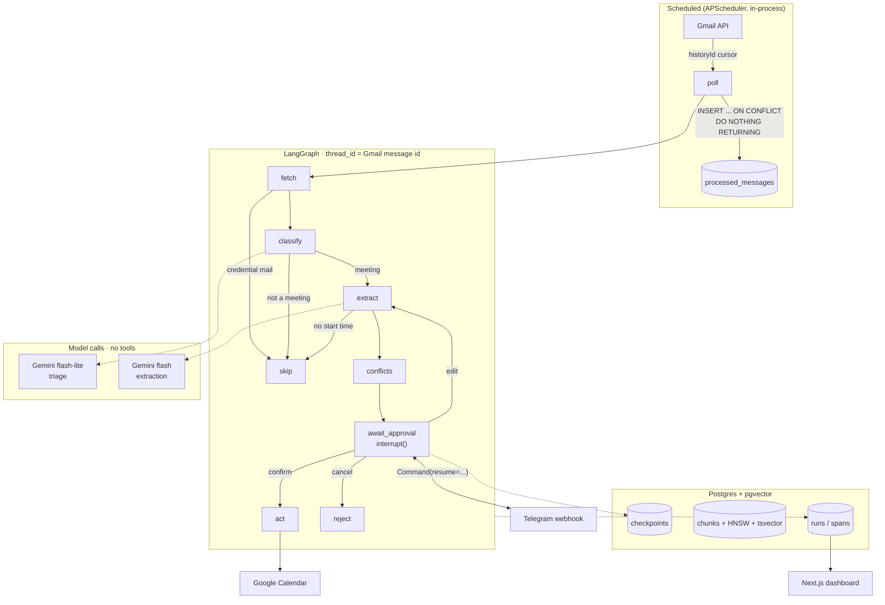

# mailagent

Reads Gmail, works out which messages are actually about scheduling something,
extracts the meeting details, checks the calendar for clashes, and sends a
Telegram card with **Confirm / Edit / Cancel**. Nothing is written to the
calendar until a human taps Confirm.

The scheduling is the excuse. The subject is production LLM engineering:
evaluation before implementation, durable human-in-the-loop state, retrieval
that was measured rather than assumed, per-run cost accounting, and a dashboard
over all of it.

> **Demo video and screenshots: not yet recorded.** They are the last
> outstanding deliverable — see [Status](#status). Restricted OAuth scopes mean
> nobody but the owner can authenticate against a deployed instance, so a video
> is the only way a reviewer can watch this run.

---

## Architecture



One FastAPI process holds the webhook and the scheduler. Not three services for
a few dozen emails a day.

Email is attacker text, so no model that reads it holds a tool (M18). Mail is
scrubbed of codes and links where it enters, credential mail is set aside
before any model reads it, and the email sits between markers made fresh for
each call, apart from the owner's own corrections. The retrieval corpus waits
for a planner that reads the owner's requests rather than raw mail (M19).

### Mail sync (M20)

The poller used to read the newest page of ten unread messages, so mail the
owner opened on a phone first was never seen, and sent mail never was. Now a
sync job reads Gmail's history every two minutes from a stored cursor
(`app/mail/`): every Primary, Updates, Forums and sent message is kept as
metadata only -- labels, time, addresses and the bulk headers, fetched
through a field mask, never a subject, snippet or body. The meeting pipeline
reads new Primary mail from that record, read or not, strictly inbound and
not bulk; mail first reached more than seven days late is recorded, not
processed.

When Gmail stops keeping the cursor's history after an outage, the sync
records the gap, moves to the present, and works the gap off in the
background, re-fetching the week's messages so nothing trashed meanwhile is
fed. A 90-day backfill runs behind it. One pacer keeps every Gmail call in
the process inside the per-user quota, with a third reserved for the sync. A
daily recall checks both halves: that the sync stored what Gmail lists, and
that the feed processed what it stored. `python -m app.mail.sync --status`
shows where it stands; [`docs/DEPLOY.md`](docs/DEPLOY.md) section 10 is the
runbook.

---

## Evaluation

**The eval harness was built before the extractor existed.** Its first run
scored a stub at 0%. That ordering is the only reason any number here means
anything: an accuracy claim needs a baseline measured *before* the improvement,
and you cannot produce one retroactively.

14 hand-labelled fixtures — 9 meetings, 5 non-meetings — covering relative
dates, timezone-crossing invites, all-day events, reschedules, cancellations,
forwarded threads and newsletters. False positives are the failure users
actually notice, so a third of the set exists to catch them.

| Extractor | Fixtures | Exact match | Notes |
|---|---|---|---|
| `always_no` | 14 | 35.7% | The floor. Every non-meeting, by accident. |
| `always_yes` | 14 | 0.0% | Never right about the fields. |
| **`gemini` (frozen baseline)** | **14** | **92.9%** | 13/14. One miss: attendees on an all-day event. |
| `gemini` (meeting slice) | 9 | 100.0% | Clean run, 2026-08-17. |
| `gemini_reviewed` | 9 | *not measured* | Two attempts lost to a 503 and a daily quota. |

**Why there is no progression table.** The plan sketched one — baseline, then
`+ date grounding`, `+ timezone in schema`, `+ few-shot`. That shape assumes
those arrived as successive fixes to a weak first attempt. They did not: because
the eval set came first, the failure modes were known before the extractor was
written, so date grounding and an IANA-zone field were in the *first* version.
The frozen 92.9% already includes them. Inventing a lower "before" number to
make a nicer table would be the exact dishonesty this harness exists to prevent.

Scoring is field-level: `is_meeting` precision/recall/F1, `start`/`end` exact to
the minute in UTC, attendees by micro-averaged F1, titles fuzzy. The headline is
strict — every field right, or the fixture is wrong.

```powershell
.\tasks.ps1 eval --extractor gemini
```

### Retrieval, measured

Full table and reasoning: [`results/retrieval-comparison.md`](results/retrieval-comparison.md).
29 hand-labelled queries over 343 chunks of a real mailbox.

| Config | hit@5 | MRR |
|---|---|---|
| **vector only** | **100%** | **0.951** |
| keyword only (BM25) | 83% | 0.791 |
| RRF fusion | 93% | 0.898 |

**Hybrid retrieval lost.** The keyword half never returned a relevant message
that vector search had missed — including on bare order references, the one
category it was picked to win — so fusion had nothing to add and could only
displace correct results. Fusion is built, tested, and switched off. No reranker
was added, because vector-only is already at 100% hit@5 and reranking cannot
add a document retrieval never returned.

---

## Cost

Token counts are measured: the API reports them and `spans` stores them raw.
Dollars are those counts times a hand-entered rate table, so a dollar figure is
only as good as the rates behind it.

| Stage | Cost | Basis |
|---|---|---|
| Triage (classify) | **~$0.081 per 100 emails** | *estimated* — measured tokens × published rates |
| Triage on Jev (opt-in) | not yet measured | list price only: $0.042 per 1M input tokens, output free |
| Extraction | not yet measured in production — see below | — |
| Retrieval ingestion | ~$0.011 for 343 chunks from 272 messages | *estimated* — from a character count |

Three caveats, all load-bearing:

**This section used to say $0.025 per 100 emails, from placeholder rates.** The
token counts behind it were real; the rate table was not. It priced
`gemini-3.5-flash-lite` at $0.10 in / $0.40 out per million tokens against a
published $0.30 / $2.50, so triage was understated about 3.2×. The rates are now
checked against [Google's pricing page](https://ai.google.dev/gemini-api/docs/pricing)
(2026-09-30). The database holding the traced spans was not reachable when they
were corrected, so ~$0.081 is recomputed from the token counts recorded when
those runs were reported — 3 runs, 6,943 input and 141 output tokens, none
thinking or cached ([M08 notes](docs/plans/M08-observability.md)) — not
re-queried from `spans`. Nor has it been reconciled against a Google invoice.
Hence *estimated*.

**The triage figure is triage-only.** Every traced production run so far has
been a non-meeting, so it stopped after the cheap classify call. Emails that do
become meetings add an extraction call, and the honest position is that the
blended number is not yet known.

**Ingestion cost is estimated, not measured.** The embeddings endpoint returns
no usage metadata at all — no token counts, no billable characters — so unlike
generation this can only be derived from a character count. Every field carrying
it is named `estimated_`.

Token counts are stored raw alongside the dollars, so history can be recomputed
when rates change, and each span is priced at the rate in force on the day it
ran. That matters on 2027-01-01, when the 3.6 and 3.7 Flash models used for
extraction and review double in price; triage's 3.5 Flash-Lite does not change.
An unpriced model records `NULL`, never `0`: zero is a positive claim that
something was free, and the dashboard renders it as `unpriced`. Spans written
before the correction still hold the `cost_usd` they were written with, so the
dashboard shows the old, understated totals for that period until
`.\tasks.ps1 reprice` recomputes those rows from their stored tokens. It
re-totals finished runs in the same transaction, `--dry-run` shows what it would
change, and a second run changes nothing.

---

## What broke, and what it changed

The most useful section in this repo.

### The eval set had to come first, and that reordered the whole plan

The original roadmap put evaluation in phase 3, after "run it on 20 real emails
and log what it gets wrong" in phase 1 — with nothing to compare against. Every
prompt change in between would have been unmeasured. Moving the harness to
module 2, before any extractor existed, is what makes 92.9% a real number.

### Timezones are an accuracy problem, not a formatting problem

The model is **never asked for UTC**. It returns local wall-clock time plus an
IANA zone name, and Python converts. The schema forbids offsets in as many words:
*"Never an offset like `+05:00`."* Ask a model to do timezone arithmetic and it
will confidently hand back an offset that is wrong for half the year. This one
decision is responsible for a large share of the score.

### An auth bypass, found by running the server rather than reading it

A blank `TELEGRAM_WEBHOOK_SECRET=` in `.env` became `SecretStr("")`, which is
not `None` — so the webhook considered itself configured and then matched an
empty header. **Any request with an empty secret header authenticated.**
Verified as a live 200 before the fix. Now a blank secret means *unset* at the
settings layer, and comparison uses `compare_digest`.

### The embeddings SDK silently collapses a batch, model-dependently

Passing `list[str]` to `embed_content` returns one vector per string on
`gemini-embedding-001` and a **single** vector for the whole list on
`gemini-embedding-2` — bare strings are packed into one multi-part document.
Three chunks in, one vector out. Nothing raises; code that zips inputs to
outputs then files every embedding against the wrong chunk, and the only symptom
is retrieval that is confidently irrelevant forever. Always send `list[Content]`,
and refuse any batch whose length does not match its input.

### `plainto_tsquery` ANDs its terms

The first retrieval comparison scored BM25 at 34%, which read as a plausible
story about keyword search being weak on natural language. It was
`plainto_tsquery` requiring *every* stem to appear in one chunk. Rewriting the
query as an OR through `websearch_to_tsquery` took it to 83% — and the corrected
number is the one that **undermined** the hybrid design shipped the day before.

### A quota outage nearly became an accuracy regression on the chart

Fixtures that raise are scored as "not a meeting", and the runner has always
said so loudly — on the terminal. That warning lived nowhere else, so the saved
JSON was indistinguishable from a real run and would have published a 33.3%
daily-quota failure onto the dashboard's accuracy chart as a genuine regression.
Results now record `errors` and `trustworthy`, invalid runs are named
`eval-INVALID-…`, and publishing refuses them.

### Reading the output caught four bugs a green test suite did not

Numeric HTML entities were never decoded, so `&#128206;` was being embedded
verbatim. Flattened HTML tables padded every chunk with twenty spaces of
indentation — one chunk shrank from 795 to 599 characters. A sign-off with a
name, phone number and URL on one line reads as prose by every length test.
And removing a quoted line has to consume its newline, or every deletion leaves
a blank line — which is a paragraph boundary, so chunks were splitting along
seams that existed only because something had been deleted there.

### The free tier is 20 requests per day, per model

Not a footnote — it is why the two extraction stages are pinned to *different*
models, and why the reviewer, removed in M18, used a third and never had its
eval delta measured. The embeddings quota is worse in a more interesting way: it
counts **documents, not requests**, so batching buys fewer round trips and no
throughput at all. A 300-message backfill hit the wall a third of the way in and
— because the whole run was one transaction — discarded every embedding it had
already paid for. Now paced with a sliding window and committed per batch.

### A "measured" cost was built on placeholder rates

The rate table said in a comment that its numbers were placeholders, and the
README still quoted what they produced as *measured* — because the token counts
underneath were. A dollar figure is tokens × rates and inherits the weaker of
the two. Checked against the pricing page, triage came out 3.2× higher.

Checking the table turned up a second bug. Gemini's `prompt_token_count`
already includes `cached_content_token_count`, and the cost function added the
cached count on top — billing every cached token twice, so a cache hit came out
dearer than a miss. The recorded runs had no cache hits, so the triage figure
was not affected by it. Rates now carry the day they take effect, and the tests
restate the published price list, so a typo has to be made twice to ship.

---

## Known limitations

- **OAuth refresh tokens expire every 7 days.** Personal Gmail plus restricted
  scopes means the app stays in "Testing" publishing status, where Google
  invalidates refresh tokens weekly. Handled with a `reauth` command and a
  pre-expiry Telegram alert rather than the CASA verification process, which
  costs hundreds of dollars and months. A Google Workspace account would remove
  the limit entirely via "Internal" publishing.
- **Nobody else can log in.** Unverified restricted scopes mean only accounts on
  the OAuth test-user list can authenticate. "Public" here means *deployed and
  demoable by the owner*, not *strangers can sign up*.
- **Single user by design.** No multi-tenancy, no user system. The dashboard
  uses one shared token.
- **The corpus holds third parties' personal data** — names, postal addresses,
  phone numbers — because that is exactly the context retrieval exists to
  provide. Redaction would destroy the entity information the agent needs. The
  `chunks` table carries the same sensitivity as the mailbox itself and must not
  leave a local or managed database.
- **Some hidden text still reaches the model.** Text hidden by a stylesheet
  class, or coloured like its background, is beyond what inline markup shows;
  the injection cases record it as a known gap. Nothing it says can act: no
  model holds a tool, and every action waits for the owner's Confirm.
- **The credential and code rules are English.** A one-time code worded in
  another language is scrubbed only if it sits near an English cue word.
- **The failures dashboard view has never rendered real data.** Nothing has
  failed in production yet.

---

## Running it yourself

### Prerequisites

- [uv](https://docs.astral.sh/uv/) — manages Python too, no separate install
- Docker Desktop, running
- A Google Cloud project with the Gmail and Calendar APIs **enabled** (auth
  working proves nothing about the APIs being switched on — that one costs an
  evening)
- A Gemini API key
- A Telegram bot token from BotFather

```powershell
.\tasks.ps1 setup      # venv + dependencies
.\tasks.ps1 up         # Postgres with pgvector
.\tasks.ps1 migrate    # apply schema
```

Copy `.env.example` to `.env` and fill it in. Only `DATABASE_URL` and
`GEMINI_API_KEY` are needed to boot; Google and Telegram values are needed to do
anything useful.

```powershell
.\tasks.ps1 fernet     # generate the token-encryption key
.\tasks.ps1 reauth     # OAuth consent; resets the 7-day clock
.\tasks.ps1 smoke      # list 10 emails, create and delete a test event
```

### Everyday

```powershell
.\tasks.ps1 check              # lint + format + typecheck + test
.\tasks.ps1 eval               # score the extractor against the golden set
.\tasks.ps1 eval --extractor jev   # same, triaging on Jev via Vercel AI Gateway
.\tasks.ps1 poll --limit 5     # process unread mail once
.\tasks.ps1 serve              # FastAPI: webhook + scheduler
.\tasks.ps1 ingest             # incremental retrieval ingestion
.\tasks.ps1 ingest --backfill  # wider window, higher limit
.\tasks.ps1 search "who is X"  # query the corpus by hand
.\tasks.ps1 retrieval-eval --by-kind
.\tasks.ps1 injection-eval --baseline   # the injection suite's model half
```

Dashboard:

```bash
cd dashboard && npm install && npm run dev
```

Deployment runbook: [`docs/DEPLOY.md`](docs/DEPLOY.md).

### Safety defaults

- `DRY_RUN` defaults to **true**. Every Calendar write path checks it.
  Forgetting to set it is safe, not destructive.
- `ALLOWED_CHAT_IDS` defaults to **empty** — nobody can talk to the bot. This
  bot can read your email; the allowlist is not optional hardening.
- `INGEST_ENABLED` defaults to **false**. It spends money without anyone having
  asked for anything.
- The dashboard admits one verified Google address, `OWNER_EMAIL`. A blank value admits nobody.
- Every side effect goes through one registry, under an approval bound to
  the exact arguments and the `DRY_RUN` the owner saw: a Confirm from an
  older card, or one for a proposal made under the other mode, is refused.
- An invite's guests must be in the email's thread, or allowed by the owner.
  Anyone else blocks the Confirm until they are.
- Model spending stops at `MONTHLY_BUDGET_USD` a month (default $40), and one
  message at `MESSAGE_CEILING_USD` ($0.50). A model with no price is never
  called.
- The owner can pause the agent, and withdraw a queued decision, from the web
  app or the command line.
- Every attempt to act, refusals included, is recorded in an append-only audit
  log that quotes no email.
- Email is data, never instruction (M18):
  - Links become `[link: host]`, except meeting links, which keep no passcode.
  - Codes near a cue word are removed.
  - Mail that hands over a code, a sign-in link or a secret is set aside before
    any model reads it.
  - The owner's correction travels in the system instruction, apart from the
    email.
  - No model that reads mail holds a tool.
  - Each guest on a card says where it came from.
  - The ledger and stored errors quote no email.
- An injection suite checks all of it with no model in CI, through the
  preparation, the prompt and a model that obeys every injection. A committed
  run on the real model is tied by a hash to the code that shapes the prompt.
- Real email lives in gitignored directories. Only anonymised fixtures are
  committed, and the labelled retrieval queries are not committed at all.

---

## Layout

```
app/
  contracts.py     the three models every module speaks
  config.py        typed settings, validated at startup
  google/          OAuth, Gmail reads, Calendar writes
  extraction/      two-stage Gemini pipeline and its prompts; no tools
  policy/          the registry, approvals, the spend gate, the scrubber
  rag/             clean -> chunk -> embed -> pgvector, and search
  graph/           LangGraph orchestration + Postgres checkpointer
  telegram/        approval cards, allowlist, callbacks
  store/           idempotency ledger, Gmail cursor, migrations
  obs/             traces, token accounting, pricing
  eval/            scorer, fixtures, retrieval eval, publishing
  jobs/            poller, scheduler, ingestion
dashboard/         Next.js, five views over the trace tables
docs/plans/        per-module plans with running notes
results/           committed eval evidence
```

`docs/plans/` is worth reading before the code. Each module records what broke
and why the fix is what it is.

---

## Status

| Module | State |
|---|---|
| M00–M05, M08–M12 | done |
| M06 Telegram HITL | code complete; Telegram unreachable from the dev network |
| M07 Deploy | deployable, not deployed |
| M13 Reviewer agent | removed in M18: a second opinion from the same evidence, and a path for injected text |
| M14 Packaging | pipeline done; **demo video and screenshots outstanding** |
| M15–M20 (v2) | see [`ASSISTANT-PLAN.md`](ASSISTANT-PLAN.md) and `docs/plans/` |

The two open v1 items share one blocker each: a deploy (M06/M07) and a screen
recording (M14).
